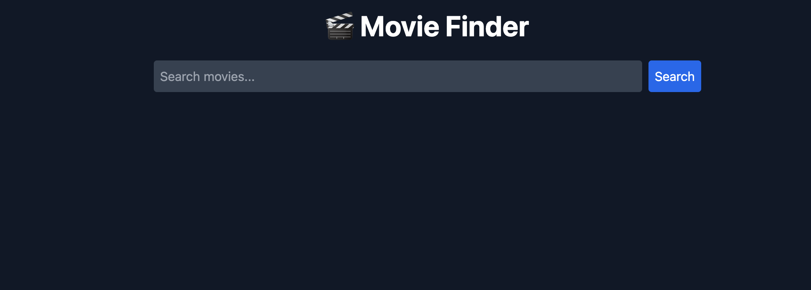
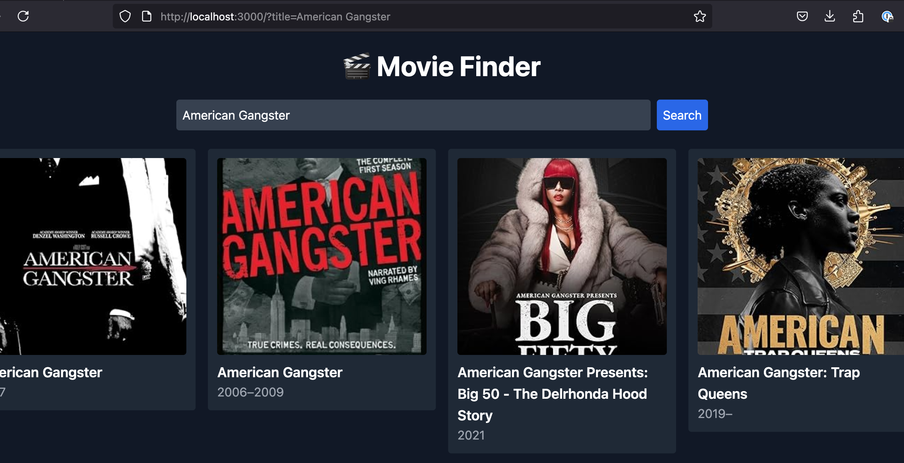
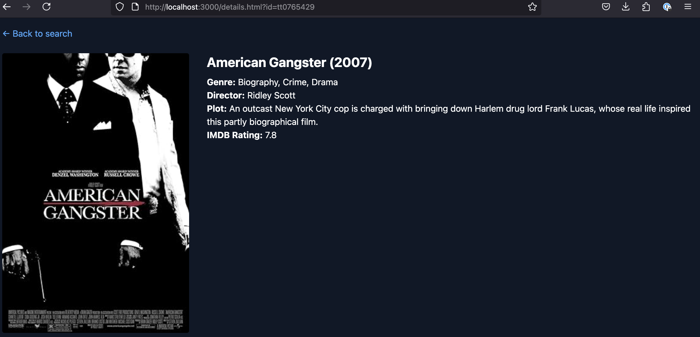
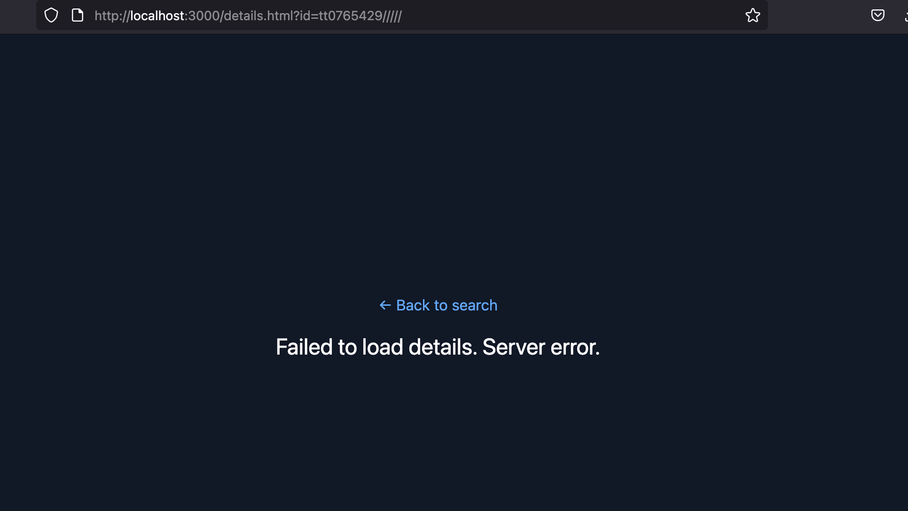

# 🎬 Movie Finder

Movie Finder is a responsive web application built with **Node.js**, **Express**, and vanilla **JavaScript**. It uses the **OMDb API** to fetch movie data, displaying search results and detailed movie information on a dedicated page. Styled entirely with **Tailwind CSS** via CDN for rapid prototyping and consistent design.


---

## 🚀 Features

🎥 **Movie Search:** Look up any movie title to see a grid of matching results from OMDb.

📝 **Dedicated Details Pages:** Click a movie to navigate to `/details.html?id=...` and view extended plot, genre, director, ratings.

🎨 **Responsive UI:** Built with Tailwind CSS loaded via CDN for instant styling, adapting seamlessly across devices.

🖼 **Fallback Poster:** If OMDb returns `Poster: "N/A"`, a local placeholder image is displayed.

🚨 **Clean 404 JSON:** API routes gracefully return `{ Failed to load details. Server error }` for unmatched endpoints.


---

## 🚢 Live Deployment

_This project can be easily deployed on platforms like **Railway**, **Render**, or **Heroku**. Simply push your repository and add the `OMDB_API_KEY` environment variable._

---

## 🚀 Local Setup & Installation

To set up and run this project locally:

1. **Clone the repository**

```bash
git clone https://github.com/YusufBolden/movie-finder-api.git
cd movie-finder-api
npm install
```
---
## 🚀 Features

🎥 **Movie Search:** Enter a title to search for multiple matching movies.

📝 **Movie Details:** Click any result to view full details (plot, genre, director, ratings) on a dedicated page.

⚡ **Fast CDN UI:** No build step — Tailwind is loaded via CDN, so styles apply instantly.

📱 **Responsive Design:** Works cleanly on desktops, tablets, and mobile.

🚨 **404 Handling:** Invalid API requests return clean JSON errors.

🖼 **Fallback Images:** If a movie has no poster, a placeholder is displayed.

---

## 🚀 Local Setup

To set up and run this project locally with Tailwind CSS and Vite:

1. **Clone the repository**

```bash
git clone https://github.com/YusufBolden/ip-address-tracker.git
cd ip-address-tracker
```

2. **Install project dependencies**

```
npm init -y
npm install express axios nodemon dotenv
```
This installs:

package.json

express for the web server

axios for HTTP requests to OMDb

dotenv for environment variables

nodemon for auto-restarting in development

3. **Create your .env file**

```
OMDB_API_KEY=your_omdb_api_key_here

```

4. **Run dev and type scripts to add to package.json**

```
npm pkg set type="module"
npm pkg set scripts.dev="nodemon server.js"
```

5. **Start the development server with nodemon**

```
npm run dev
```

6. **Open your browser**

```
http://localhost:3000
```
---

## 🗄️ File Structure
```
movie-finder-api/
├── controllers/
│   └── movieController.js
├── routes/
│   └── movieRoutes.js
├── public/
│   ├── 404.png
│   ├── app.js
│   ├── details.html
│   ├── details.js
│   ├── home.png
│   ├── index.html
│   ├── movieDetails.png
│   ├── placeholder.png
│   ├── reel.png (favicon)
│   └── searchResults.png
├── .env
├── .gitignore
├── package.json
└── server.js

```
---

## 📸 Previews

### Home Page 


### Search Results


### Movie Details


### Invalid url


---

## 🧑🏿‍💻 Author

Created by [Yusuf Bolden](https://github.com/YusufBolden). Feedback and suggestions are welcome!

---

## 📄 License

This project is licensed under the [MIT License](https://opensource.org/licenses/MIT).
